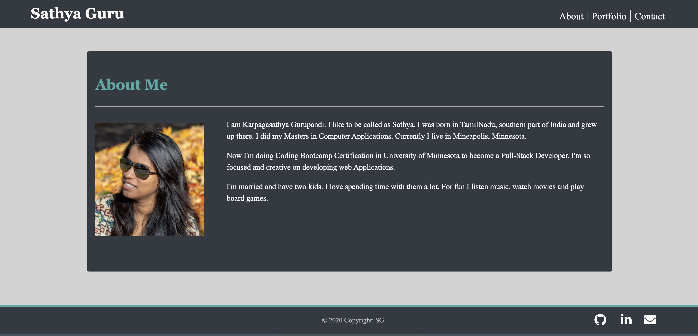

# Portfolio

## Description
This Application was an Updated portfolio page using HTML, CSS, Bootstrap. Features mobile responsiveness & navbar shortcuts for easy navigation.

## Features

* This Application displays some information about me, as well as links to my GitHub profile, my LinkedIn profile, and a pdf of my resume. 
* It also displays some projects which I feel show off my web development abilities particularly well.
* The project is comprised of 3 separate files, and the navbar at the top of the screen allows for navigation among the different files.
* Portfolio page describes the projects with images link that leads to the deployed github pages.

You can view my Portfolio [here](https://karpagasathya.github.io/portfolio/)

## ScreeShots

